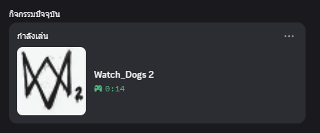

# Simple Discord RPC with GeForce NOW Game Detection

A Discord Rich Presence application with automatic game detection for GeForce NOW. Displays the game you're currently playing along with its artwork, automatically finding the game's official Discord Application ID when available.

## Preview



## Features

- Automatic game detection from GeForce NOW window titles
- Auto-fetches game artwork from SteamGridDB (square format for optimal Discord display)
- Searches for official Discord App ID from 3000+ verified games list
- Optimized O(1) lookup algorithm for instant game identification
- Fallback to custom App ID with artwork from SteamGridDB
- Real-time updates when switching games
- Configurable display format and check intervals

## Requirements

- [Node.js](https://nodejs.org/en/download)
- [Discord Desktop Application](https://discord.com/download) (must be running)
- [Discord Developer Application](https://discord.com/developers/applications) (for custom App ID fallback)
- [SteamGridDB API Key](https://www.steamgriddb.com/profile/preferences/api) (optional, for artwork)

## Installation

1. Clone or download the source code
2. Install dependencies:
   ```bash
   npm install
   ```
3. Configure your settings in `config.js`
4. Start the application:
   ```bash
   npm start
   ```

## Configuration

### Discord Application Setup

1. Visit [Discord Developer Portal](https://discord.com/developers/applications)
2. Create a new application
3. Copy the Application ID
4. Paste it into `config.js`:
   ```javascript
   applicationId: 'YOUR_APPLICATION_ID'
   ```

This custom App ID serves as a fallback when the detected game is not in Discord's verified games list.

### Game Detection Settings

```javascript
gameDetection: {
  enabled: true,              // Enable automatic detection
  checkInterval: 5,           // Check interval in seconds
  formatString: 'Playing: {game}',  // Display format
  autoFetchImage: true        // Auto-fetch artwork from SteamGridDB
}
```

### SteamGridDB API Key (Optional)

For optimal square artwork that fits Discord's display:

1. Create an account at [SteamGridDB](https://www.steamgriddb.com/)
2. Generate an API key from your profile settings
3. Copy `.env.example` to `.env` and add your key:
   ```bash
   STEAMGRIDDB_API_KEY=your_api_key_here
   ```

> **Note:** The `.env` file is gitignored and will not be committed to your repository.

## How It Works

### Startup Process

1. Detects currently running game from GeForce NOW window title
2. Searches for game's official Discord App ID using O(1) Map lookup (< 1ms)
3. If found: connects using the game's official App ID (appears in "Recent Activities")
4. If not found: connects using your custom App ID with artwork from SteamGridDB
5. Updates Discord Rich Presence with game name and artwork

### Detection Algorithm

The application uses an optimized lookup system:

- **Game Detection**: Window title scanning (50ms)
- **App ID Lookup**: Hash Map O(1) search (< 1ms)
- **Artwork Fetch**: SteamGridDB API (100-300ms)
- **Total Startup**: < 500ms

## File Structure

```
src/
├── index.js                 # Main application entry
├── utils/
│   ├── gameDetector.js      # GeForce NOW window detection
│   ├── gameImageFetcher.js  # Steam artwork fallback
│   ├── steamGridDB.js       # SteamGridDB API integration
│   ├── discordGamesList.js  # Discord verified games lookup (O(1))
│   └── testGameDetector.js  # Testing utility
├── schemas/
│   └── ConfigSchema.js      # Configuration validation
└── config.js                # User configuration
```

## Testing

Run the test utility to verify game detection:

```bash
# Single test
node src/utils/testGameDetector.js

# Continuous monitoring
node src/utils/testGameDetector.js --watch
```

## Troubleshooting

**Application ID Error**: Ensure you have entered a valid Discord Application ID in `config.js`

**Game Not Detected**: Make sure GeForce NOW is running and a game is actively streaming

**Images Not Loading**: Check your SteamGridDB API key or disable `autoFetchImage` to use default assets

**Connection Issues**: Verify Discord is running on the same machine and logged in

**Game Not in Recent Activities**: Some games may not have official Discord App IDs in the database. The application will fall back to your custom App ID with artwork.

## Data Sources

- Discord Verified Games List: [gameslist.json](https://gist.github.com/1271/cf4b6a3b562532988fa5b0688102b2cc)
- Game Artwork: [SteamGridDB](https://www.steamgriddb.com/)
- Fallback Artwork: [Steam Store](https://store.steampowered.com/)

## Original Project

Based on [simple-discord-rpc](https://github.com/Jxyme/simple-discord-rpc) by Jxyme.

## License

ISC

